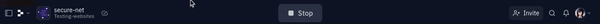
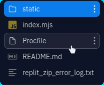
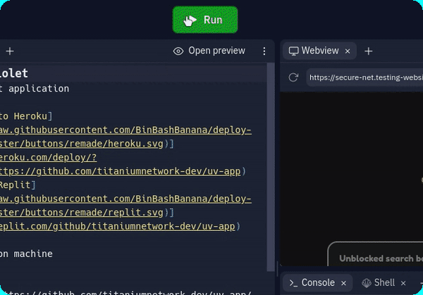

<a href="https://SECURE-NET.testing-websites.repl.co/">
    
</a>


# Setting up SECURE-NET (Ultraviolet)
## __*First step*__

fork this repl.
(you've probably already done this.)

Also, if you don't see the sidebar where you manage the files, do this.


___

## __*Second step* (Optional Step, but highly reccomended)__

Go to the `static` folder, then `index.html` or `ultraviolet.css`



Then if you want to, make some changes and cuztomize it. LEARN HTML and CSS, its EASY! 


```css
body {
    margin: 0;
    background: #111;
    display: flex;
    flex-direction: column;
    min-height: 100vh;
}
```

>:point_up_2:I recommend changing and playing around with css code in `ultraviolet.css` :point_up_2:

___

## __*Third step*__

__Press Run!__



Now you have hosted your own Ultraviolet unblocker/proxy website on replit!

>__Also, use this at your own risk! Be safe! Don't misuse this!__
___
# Made by __EJ__ or AKA __[T3RM1N4L](https://replit.com/@Testing-websites)__

```
Also, why R U here?
```