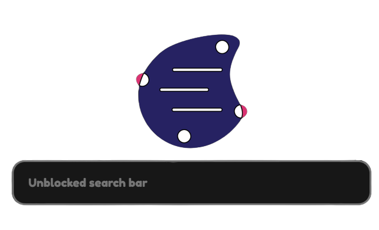

<!-- PROJECT LOGO -->
<br />
<div align="center">
  <a href="https://SECURE-NET.testing-websites.repl.co/">
    
  </a>

  <h3 align="center">SECURE-NET</h3>

  <p align="center">
    A front-end of ultraviolet 
    <br />
    <a href="https://home-page.testing-websites.repl.co/"><strong>Creator's homepage »</strong></a>
    <br />
    <br />
    <a href="https://SECURE-NET.testing-websites.repl.co/">View Demo</a>
    ·
    <a href="https://replit.com/@Testing-websites/SECURE-NET?v=1">Report Bug</a>
    ·
    <a href="https://replit.com/@Testing-websites/SECURE-NET?v=1">Request Feature</a>
  </p>
</div>

<!-- ABOUT THE PROJECT -->

___
## About The Project


<div align="center">

</div>


There are many great Proxies out there, but sadly every single one of them were blocked. That's when I thought, "Can't I just make a front-end for Ultraviolet?". And here I am, editing this `README.md` to upload this Repl. This proxy uses IP adress cloaking and cookies too, this leads for a great experience. 

**"A Dream Come True"**

I also a few things to say after creating this:
* Your time should be focused on creating something amazing. A project that solves a problem and helps others.
* You shouldn't waste your time working on something STOOOPID.
* **I LIKE TURTLES!** :smile:
___
# Getting started

You can use the given website... but I highly reccomend froking and using your own. (Instructions are given after you fork this project. Try it yourself!). This is because the priginal website might get stressed way too mcuh and make it harder for unblocking things.

# Deploy Secure-net

[](https://heroku.com/deploy/?template=https://github.com/T3M1N4L/secure-net)
[](https://replit.com/github/T3M1N4L/secure-net)
[](https://glitch.com/edit/#!/import/github/T3M1N4L/secure-net)
[](https://deploy.azure.com/?repository=https://github.com/T3M1N4L/secure-net)
[](https://cloud.ibm.com/devops/setup/deploy?repository=https://github.com/T3M1N4L/secure-net)
[](https://console.aws.amazon.com/amplify/home#/deploy?repo=https://github.com/T3M1N4L/secure-net)
[](https://deploy.cloud.run/?git_repo=https://github.com/T3M1N4L/secure-net)

[](https://railway.app/new/template?template=https%3A%2F%2Fgithub.com%2FT3M1N4L%2FHoly-Unblocker)

[](https://app.koyeb.com/deploy?type=git&repository=github.com/T3M1N4L/secure-net-Old&branch=main&name=secure-net&run_command=npm%start)

### Disclaimer!

Sometimes it can take a while to load. So please wait. Also, sometimes it migh not work, reload and try again, or comment on the original Replit page. This might be becasue Titanium Network is working on their servers.

>__Also, use this at your own risk! Be safe! Don't misuse this!__

___

# Made by __EJ__ or AKA __[T3RM1N4L](https://replit.com/@Testing-websites)__

```
Also, why R U here?
```
